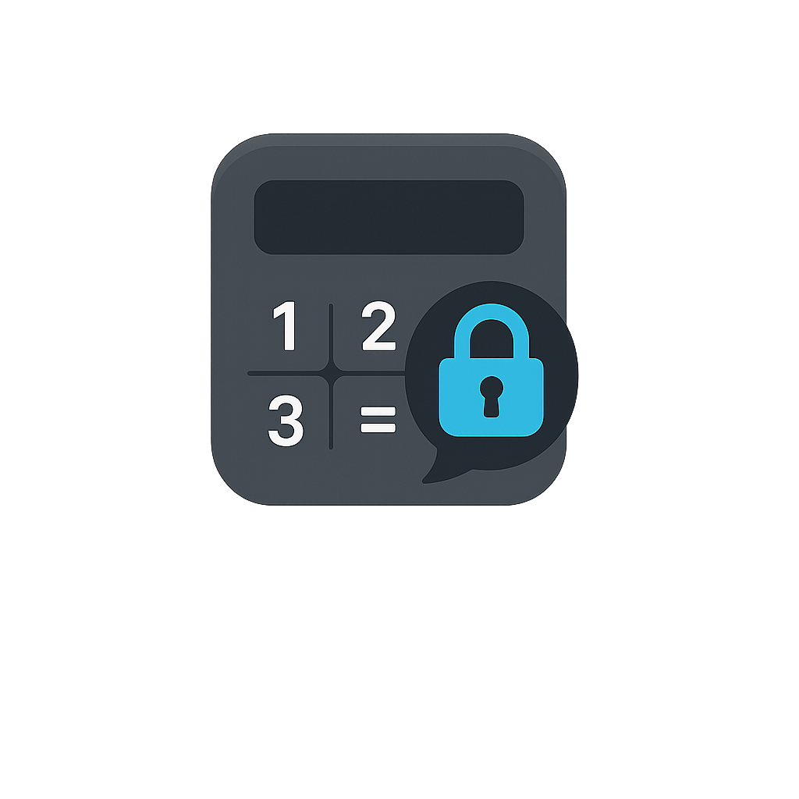

<p align="center">
    
</p>

<p align="center">
    <h1 align="center">HarpoChat</h1>
</p>

<p align="center">
    <em><code>❯ Discreet end‑to‑end encrypted chat disguised as a calculator</code></em>
</p>

<p align="center">
    
    
    
    
</p>

<p align="center">
    <em>Developed with the tools below.</em>
</p>

<p align="center">
    
    
    
    
    
</p>

---

## 🔗 Table of Contents

- [🔗 Table of Contents](#-table-of-contents)
- [📍 Overview](#-overview)
- [🧙 Name Origin](#-name-origin)
- [👾 Features](#-features)
- [📁 Project Structure](#-project-structure)
- [🚀 Getting Started](#-getting-started)
  - [☑️ Prerequisites](#️-prerequisites)
  - [⚙️ Installation](#️-installation)
  - [🤖 Usage](#-usage)
- [🧪 Future Testing](#-future-testing)
- [📌 Project Roadmap](#-project-roadmap)
- [🔰 Contributing](#-contributing)
- [🎗 License](#-license)

---

## 📍 Overview

**HarpoChat** is a demonstration Android application that combines a modern **encrypted messenger** with a **fully‑featured calculator facade**.  The app launches as a convincing calculator; only by entering a pre‑configured secret PIN does the secure chat reveal itself.  A secondary *duress* PIN instantly wipes the secure store.  Behind the façade lies a Compose‑based chat UI backed by the open‑source **Signal Protocol** for true end‑to‑end encryption.  The project illustrates how to meld encryption, reactive data flows and Jetpack Compose into a seamless, security‑focused experience.  It is intended for educational purposes and is not yet production ready.

---

## 🧙 Name Origin

The name **HarpoChat** pays homage to **Harpocrates**, the Hellenistic god of silence and secrets.  In Greek mythology, Harpocrates was adapted from the Egyptian child‑god **Horus**.  Greeks and Romans saw statues of the boy Horus with his finger to his mouth and misinterpreted the pose as a command for secrecy.  As a result, Harpocrates became known as the deity of silence, secrets and confidentiality.  Naming the project after Harpocrates underscores its goal: keeping conversations hidden and private.

---

## 👾 Features

- 🔐 **Discreet Calculator Interface** – the application launches into a complete calculator.  It includes basic operations, memory functions (MC, M+, M-, MR), a two‑line display with expression preview and animated transitions.  A secret PIN unlocks the chat, while a duress PIN clears the secure preferences and displays a “Memory cleared” toast.
- 📱 **Orientation‑Aware UI** – the calculator adapts its layout for portrait and landscape orientations and uses Compose’s `AnimatedContent` for smooth expression/result updates.
- 🗨️ **Conversation List** – after unlocking, users see a list of conversation previews with names, last messages, timestamps and unread counts.  A top app bar provides access to settings, and a floating action button hints at creating new conversations.
- 💬 **Secure Messaging** – conversations use a Compose chat screen and a `ChatRepository` that encrypts messages with the **Signal Protocol**.  Messages are encrypted on send, decrypted on receipt and displayed with the ciphertext length.
- 💾 **Secure Key Storage** – secret values such as the calculator PINs and Signal keys are stored in Android’s `EncryptedSharedPreferences` using a generated `MasterKey`.
- 🔄 **Reactive State** – the app relies on Kotlin Coroutines and `StateFlow` to expose message and conversation updates, automatically updating the UI.
- 🛠️ **Modular Architecture** – the codebase is organised into packages such as `calculator`, `messaging`, `crypto`, `data`, `security` and `ui`, promoting separation of concerns.

---

## 📁 Project Structure

```
HarpoChat/
├── LICENSE
├── README.md
├── build.gradle.kts
├── gradle.properties
├── gradle/            # Wrapper and version catalog
├── gradlew / gradlew.bat
└── app/
    ├── build.gradle.kts       # Module‑level Gradle script
    ├── proguard-rules.pro
    └── src/
        ├── main/
        │   ├── AndroidManifest.xml       # Defines launcher as CalculatorActivity
        │   ├── java/com/example/harpochat/
        │   │   ├── MainActivity.kt           # Chat screen using Compose
        │   │   ├── calculator/
        │   │   │   └── CalculatorActivity.kt  # Disguised calculator with PIN logic
        │   │   ├── messaging/
        │   │   │   └── ConversationsActivity.kt  # Conversation list UI
        │   │   ├── crypto/
        │   │   │   ├── CryptoEngine.kt        # Interface & fake engine
        │   │   │   ├── SignalCryptoEngine.kt  # Signal Protocol implementation
        │   │   │   └── SignalStores.kt        # Key generation & stores
        │   │   ├── data/
        │   │   │   └── ChatRepository.kt      # Handles E2EE and message flow
        │   │   ├── security/
        │   │   │   └── SecureStore.kt         # EncryptedSharedPreferences wrapper
        │   │   └── ui/
        │   │       ├── ChatScreen.kt          # Compose chat UI
        │   │       ├── ChatViewModel.kt       # Exposes messages via StateFlow
        │   │       └── theme/                 # Material theme definitions
        │   └── res/                           # Application resources
        ├── test/                              # Unit tests (empty)
        └── androidTest/                       # Instrumentation tests (empty)
```

---

## 🚀 Getting Started

### ☑️ Prerequisites

To build and run **HarpoChat** you will need:

- **JDK 17** – the project targets Java 17.
- **Android Studio Hedgehog** or later, or the command‑line Gradle wrapper.
- **Android SDK** – `compileSdk` is set to 36 and `minSdk` to 26.
- An emulator or device running **Android 8.0** (API 26) or higher.

### ⚙️ Installation

Clone the repository:

```sh
git clone https://github.com/Cronix2/HarpoChat.git
cd HarpoChat
```

Open the project in Android Studio and let it download dependencies, or build from the command line:

```sh
./gradlew assembleDebug
```

The APK will be produced in `app/build/outputs/apk/debug/`.

### 🤖 Usage

Run the app on an emulator or physical device.  You will see a dark‑themed calculator with a two‑line display, memory buttons and basic operators.  To access the hidden chat:

1. **Enter your secret PIN** using the calculator keys.  On the first launch default values are `527418` for the secret pin and `1234` for the duress pin.  The secret pin triggers the `onUnlock` callback which navigates to the conversation list.
2. **Enter the duress PIN** to immediately clear the secure preferences (erasing your stored keys and messages) and show a “Memory cleared” toast.
3. Once unlocked, select a conversation or create a new one (TODO).  Messages you send are encrypted using the Signal engine, decrypted in a loopback for demonstration and displayed alongside the byte length of the ciphertext.
4. Press the back button to return to the calculator façade.

No real network communication is implemented yet; both peers are simulated within the app.  Likewise, conversation creation and settings screens are placeholders to be expanded.

---

## 🧪 Future Testing

Automated tests are not currently implemented.  Potential future tests could include:

- Unit tests for arithmetic logic, PIN validation and encryption/decryption routines.
- Instrumentation tests to verify navigation between calculator, conversation list and chat screens.
- UI tests using Espresso or Compose Test Kit for verifying the calculator layout and chat interactions.

---

## 📌 Project Roadmap

The project is actively evolving.  Planned or potential enhancements include:

- **Real networking** – implement a back‑end or peer‑to‑peer transport so that messages are exchanged between devices instead of looped back locally.
- **User management** – support user accounts, contact lists and key exchanges.
- **Persistent chat history** – store conversations securely (e.g. with Room) instead of keeping messages in memory.
- **Configurable PINs & themes** – settings screen to change the secret/duress codes and personalise appearance.
- **Conversation creation & group chats** – allow users to start new conversations, add participants and share media.
- **Enhanced calculator** – extend operations (percentage, square root), improve animations and adapt for tablets.

Contributions and feature requests are welcome!

---

## 🔰 Contributing

Contributions are very welcome!  To contribute:

1. **Fork** the repository on GitHub.
2. **Clone** your fork:

   ```sh
   git clone https://github.com/<your-username>/HarpoChat.git
   cd HarpoChat
   ```

3. **Create a new branch** for your changes:

   ```sh
   git checkout -b your-feature-name
   ```

4. **Make your changes** and commit them with clear messages:

   ```sh
   git commit -m "Add awesome feature"
   ```

5. **Push** the branch to your fork:

   ```sh
   git push origin your-feature-name
   ```

6. **Open a Pull Request** describing your changes and why they should be merged.

Please follow the existing code style and include tests where relevant.  For major changes, open an issue first to discuss the proposal.

---

## 🎗 License

This project is licensed under the **MIT License**.  See the [LICENSE](./LICENSE) file for details.

---

🚀 **Thank you for exploring HarpoChat!**  If this project inspires you to build privacy‑focused communication tools or you learn something useful, consider starring the repository and sharing your feedback.
